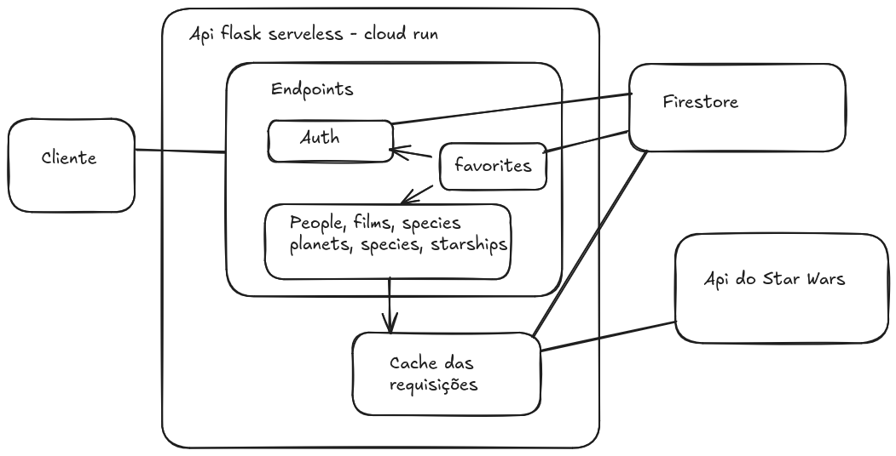

# Star Wars API

API que funciona como camada de abstração e cache para a API do Star Wars (https://swapi.dev/).

## Funcionalidades

A API oferece uma interface robusta para acessar dados do universo Star Wars, com as seguintes características:

- **Abstração da SWAPI**: Camada de proxy para todos os recursos da [SWAPI](https://swapi.dev/) (Filmes, Pessoas, Planetas, Espécies, Naves e Veículos).
- **Cache Inteligente**: Sistema de cache utilizando **Google Firestore**. Antes de cada requisição, a URL é convertida em um hash **SHA-256** usado como identificador único para buscar dados já armazenados, evitando chamadas desnecessárias à API original.
- **Autenticação Segura**: Implementação de autenticação via **JWT (JSON Web Tokens)** para proteção de rotas.
- **Gestão de Favoritos**: Permite que usuários autenticados salvem e gerenciem seus recursos favoritos.
- **Busca e Ordenação**: Suporte a filtragem e ordenação de dados em diversos endpoints.
- **Documentação Interativa**: Swagger UI completo para exploração e teste da API.

---

## Arquitetura do Projeto

O projeto segue uma arquitetura **Modular** e **Baseada em Serviços**, visando escalabilidade e facilidade de manutenção.

### Padrão de Organização
A estrutura é organizada por domínios de negócio (módulos), onde cada módulo é encapsulado:

```text
app/
├── auth/            # Gestão de tokens e identidade
├── favorites/       # Lógica de marcadores do usuário
├── films/           # Dados sobre os filmes
├── people/          # Informações sobre personagens
├── ...              # Outros domínios (planets, species, etc.)
├── database/        # Configurações e repositórios Firestore
└── swapi_client.py  # Cliente de integração com a API externa
```

### Componentes Principais
1.  **Controllers (Blueprints)**: Definem as rotas e manipulam as requisições HTTP utilizando Flask Blueprints.
2.  **Services**: Contêm a lógica de negócio e as regras de filtragem/transformação de dados.
3.  **Client/Cache**: O `SWAPIClient` gerencia a comunicação com a API original, integrando-se automaticamente com a camada de cache no Firestore.
4.  **Database**: Camada de persistência que utiliza Firestore para armazenar usuários, favoritos e dados cacheados.



### Uso de DTOs (Data Transfer Objects)

O projeto utiliza **DTOs** em conjunto com a biblioteca **Pydantic** para garantir a integridade e a validação dos dados que trafegam na API.

- **Validação Strict**: Uso de tipos como `EmailStr` e `Literal` para validar entradas (ex: `UserCreateDTO`, `FavoriteCreateDTO`).
- **Contrato de Interface**: Separação clara entre os dados recebidos pelo cliente e os modelos internos.
- **Segurança**: Modelos de resposta (ex: `UserResponseDTO`) garantem que campos sensíveis não sejam expostos.

Exemplo de DTO de criação de usuário:
```python
class UserCreateDTO(BaseModel):
    email: EmailStr
    password: str = Field(..., min_length=6)
    name: str
```

---

## Como rodar localmente

Para executar o projeto em sua máquina local, siga os passos abaixo:

### 1. Pré-requisitos

É necessário ter o **Google Cloud SDK** instalado para rodar o emulador do Firestore.

### 2. Configurar o Emulador do Firestore

Inicie o emulador do Firestore em um terminal separado:

```bash
gcloud emulators firestore start --host-port=127.0.0.1:8700
```

> [!NOTE]
> O projeto está configurado no arquivo `dev.sh` para apontar para `127.0.0.1:8700` (porta padrão do emulador).

### 3. Executar a API

Com o emulador rodando, execute o script de desenvolvimento:

```bash
./dev.sh
```

A API estará disponível em `http://localhost:8080`.

---

## Endpoints da API

Abaixo estão os principais endpoints disponíveis. Para detalhes completos sobre os esquemas de dados, utilize o [Swagger UI](http://localhost:8080/apidocs/).

### Autenticação e Usuário
Endpoints para gestão de acesso e perfil:
- `POST /auth/register`: Cria uma nova conta e retorna o token JWT e dados do usuário.
- `POST /auth/login`: Autentica o usuário e retorna o token JWT e dados do usuário.
- `GET /users/me`: Retorna os dados do usuário autenticado (Requer Token).

### Favoritos (Requer Autenticação)
Gerencie seus recursos favoritos (inclua o token no header `Authorization: Bearer <TOKEN>`):
- `GET /favorites/`: Lista todos os favoritos do usuário logado.
- `POST /favorites/`: Adiciona um novo favorito (especifique `entity_type` e `entity_id`).
- `DELETE /favorites/<fav_id>`: Remove um favorito específico.

### Recursos Star Wars (SWAPI)
Interfaces para buscar dados da SWAPI original. Todos os endpoints de listagem aceitam parâmetros de busca e ordenação.

#### Endpoints Disponíveis:
- `/people/` e `/people/<id>`
- `/films/` e `/films/<id>`
- `/planets/` e `/planets/<id>`
- `/species/` e `/species/<id>`
- `/starships/` e `/starships/<id>`
- `/vehicles/` e `/vehicles/<id>`

#### Parâmetros de Query (Listagem):
- `page`: Número da página (ex: `?page=2`).
- `search`: Busca textual (ex: `?search=luke`).
- **`sort_by`**: Ordena os resultados pelo campo especificado (ex: `?sort_by=name`).

#### Exemplo de Uso:
Para listar personagens ordenados pelo nome:
```bash
GET http://localhost:8080/people/?sort_by=name
```

---

## Documentação (Swagger)

A API possui documentação interativa utilizando Swagger (OpenAPI).

Para acessar, certifique-se de que a API está rodando e acesse:

**[http://localhost:8080/apidocs/](http://localhost:8080/apidocs/)**

Nesta interface, você pode:

- Visualizar todos os endpoints disponíveis.
- Consultar esquemas de entrada e saída.
- Testar as requisições diretamente pelo navegador.

---

## Como rodar os testes

Os testes são executados utilizando o `pytest`. Para rodá-los, execute o script:

```bash
./test.sh
```

Você também pode passar argumentos adicionais para o pytest, como:

```bash
./test.sh tests/unit # Rodar apenas testes unitários
./test.sh -v         # Modo verboso
```
